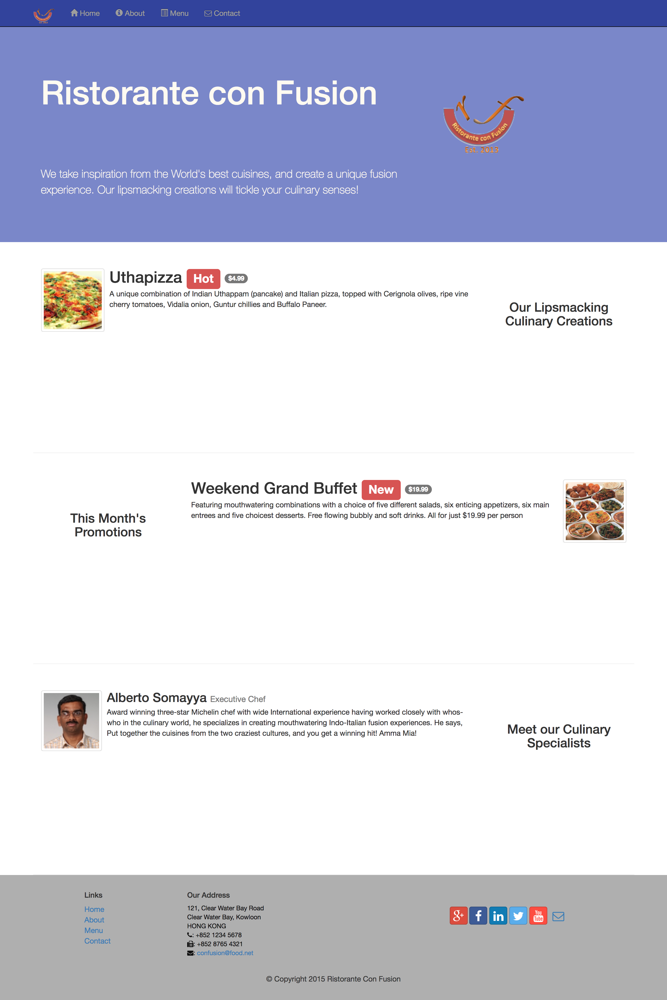

## Restaurant Web page Build by AngularJS and Bootstrap4

### Techs
[AngularJS](https://angularjs.org/) | [Bootstrap](http://getbootstrap.com/) | [jQuery](https://jquery.com/) |[NodeJS](https://nodejs.org/en/) | [MongoDB](https://www.mongodb.com/)
---| --- | --- | --- | ---


### Main Functionality
* Include Home/About/Menu/Contact sections implemented by single page application(SPA).
* In Menu section, users could view specific dish customers' comments and sort them by date/rating/author.
* The user could also submit his comments about specific dish.
* In the contact section, user could submit the feedback to the restaurant owner. 

### Usage

1. Install node packages:
```
npm install
```
2. Install JSON server
```
npm install -g json-server
```
3. Navigate to json-server directory and start json-server
```
json-server --watch db.json
```

### Image
##### Main Page


Please check out other pages in Image folder.

### License
___
MIT


